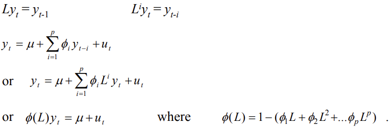

# Lecture 2 Notes: Autoregressive Moving Average (ARMA) Models

These models are an alternative to the "structural" models that we have examined so far in this module. They are easy to
set up, requiring only one data series (y). They are atheoretical and are sometimes useful for forecasting.

## Moving Average Process

- Let $u_t (t=1, 2, 3, \dots)$ be a sequence of independently and identically distributed random variables
  with $E(u_t) = 0$ and $Var(u_t) = \sigma^2$, then
  $$y_t = \mu + u_t + \theta_1 u_{t-1} + \theta_2 u_{t-2} + \dots + \theta_q u_{t-q}$$ is a qth order moving average
  model MA(q).
- Its properties are
    - constant mean
    - constant variance
    - autocovariances are zero beyond lag q

## Autoregressive Processes

An autoregressive model of order $p$, an $AR(p)$ can be expressed as
$$y_t = \mu + u_t + \phi_1 y_{t-1} + \phi_2 y_{t-2} + \dots + \phi_q y_{t-p}$$
Or, put another way, using the lag operator notation

## The Partial Autocorrelation Function

Measures the correlation between an observation $k$ periods ago and the current observation, after controlling the
observations at intermediate lags (i.e. all lags $< k$). So the PACF measures the correlation between $y_t$
and $y_{t-k}$ after removing the effects of $y_{t-k+1}, y_{t-k+2}, \dots, y_{t-1}$. At lag 1, the ACF will always equal
the PACF. At lag 2, the $PACF = \frac{\tau_2 - \tau_1^2}{1-\tau_1^2}$. For lags greater than 3, the expression gets more
complex.

The PACF is useful for telling the difference between an AR process and an ARMA process. In the case of an AR(p), there
are direct connections between $y_t$ and $y_{t-s}$ only for $s \leq p$. So for an AR(p), the theoretical PACF will be
zero after lag $p$. In the case of an MA(q), this can be written as an $AR(\infty)$, so there are direct connections
between $y_t$ and its all its previous values. For an MA(q), the theoretical PACF will be geometrically declining.

## Wold's Decomposition Theorem

States that any stationary series can be decomposed into the sum of two unrelated processes, a purely deterministic part
and a purely stochastic part. For an AR(p), Wold's decomposition theorem essentially means that the model can be written
as an $MA(\infty)$. An MA(q) can also be written as ann $AR(\infty)$.

## ARMA Process

By combining the AR(p) and MA(q) models we can obtain an ARMA(p, q) model
$$\phi (L) y_t = \mu + \theta (L) u_t$$

$$
\begin{align}
\phi(L) &= 1 - \phi_1 L - \phi_2 L^2 - \dots - \phi_p L^p \\
\theta(L) &= 1 + \theta_1 L + \theta_2 L^2 + \dots + \theta_q L^q \\
y_t &= \mu + \sum_{i=1}^p \phi_i y_{t-i} + \sum_{j=1}^q \theta_j u_{t-j} + u_t \\
E(u_t) &= 0,\quad E(u_t^2) = \sigma^2,\quad E(u_t u_s) = 0 \quad \text{for } t \ne s
\end{align}
$$

## Summary

An autoregressive process has a geometrically decaying ACF, and the number of spikes of the PACF tells you the AR order.

A moving average process bas a geometrically decaying PACF, and the number of spikes of the ACF indicate the MA order.

## Bits from the lecture

Do not make the mistake of thinking that $y_{t-1}$ does not depend on $y_{t-2}$ or $y_{t-3}$, it does. Depending on the
size of phi, this determines how persistent your process will be.

autocorrelation function (ACF) captures how much one lagged value depends on the previous one, and the partial
autocorrelation function (PACF) measures the direct dependence on the previous value by way of the coefficients of the
lagged value under investigation.

The rate of decay of the autocorrelation function in an AR(1) is exponential. We still call a model with an exponential
decay rate a short memory model and a model with a hyperbolic decay rate we call a long memory model.

The autocorrelation function dies off at the lag of the model.

Check Hamilton Chapter 3, where you can check the proof of the Wold Decomposition Theorem, which explains the structure
of the autocorrelation function.

in time series forecasting, we will be using the maximum likelihood estimator, instead of the OLS which we used largely
as an academic exercise last year.

The maximum likelihood is an algorithm that chooses the value of the unknown population parameter in such a way as to
maximize the joint density of the data.
Every random variable has a density function. The density function is the probability function that finds the
probability of a particular observation lying in some band of possible values and extracts the associated probabilities.

The joint density is the probability of lying inside that band. The beauty of the maximum likelihood estimator, is your
estimator can still be consistent even if your assumptions are slightly incorrect.